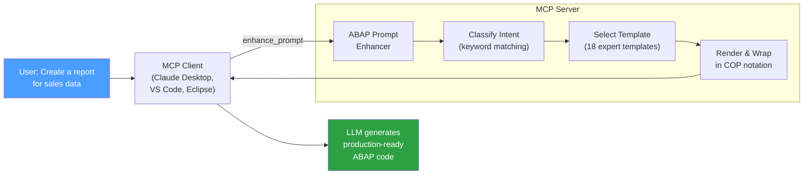

# ABAP Prompt Enhancer — MCP Server

<p align="center">
  <a href="https://github.com/pavanibockmuehl/abap-prompt-enhancer-releases/releases/latest">
    
  </a>
</p>

An [MCP](https://modelcontextprotocol.io/) server that transforms simple ABAP development requests into expert-level prompt specifications. It classifies your intent, selects a matching expert template from 18 specialized categories, and returns it in Context Optimization Protocol (COP) format — a compact coded notation that LLMs interpret as detailed, production-grade instructions.

Single binary, no runtime dependencies. Works with Claude Desktop, VS Code (GitHub Copilot), and Eclipse.

## How It Works



### Supported Templates

| Template | Code | Description |
|----------|------|-------------|
| Report | `RPT` | Executable programs with selection screens and ALV output |
| Table | `TBL` | Transparent, pool, and cluster table definitions |
| CDS View | `CDS` | DDL data definitions with annotations and view entities |
| Class | `CLS` | Object-oriented ABAP classes with methods |
| Interface | `IFC` | ABAP interface definitions |
| Unit Test | `UTG` | Test classes with test doubles and mock objects |
| Modern Syntax | `SYN` | Modern ABAP 7.40+ syntax conversion |
| Generic | `GEN` | Fallback for unmatched requests |

...and more specialized templates for refactoring, code analysis, and documentation.

## Install

**Linux / macOS:**
```bash
curl -sfL https://github.com/pavanibockmuehl/abap-prompt-enhancer-releases/releases/latest/download/abap-prompt-enhancer_$(uname -s)_$(uname -m).tar.gz | tar xz -C /usr/local/bin
```

**Windows:** Download the `.zip` from the [latest release](https://github.com/pavanibockmuehl/abap-prompt-enhancer-releases/releases/latest).

## Configuration

### Claude Desktop

Add to your `claude_desktop_config.json`:

```json
{
  "mcpServers": {
    "abap-enhancer": {
      "command": "/usr/local/bin/abap-prompt-enhancer",
      "args": ["-transport", "stdio"],
      "env": {
        "ABAP_ENHANCER_KEY": "your-encryption-key-hex"
      }
    }
  }
}
```

### VS Code (GitHub Copilot)

Add `.vscode/mcp.json` to your workspace:

```json
{
  "servers": {
    "abap-enhancer": {
      "type": "stdio",
      "command": "/usr/local/bin/abap-prompt-enhancer",
      "args": ["-transport", "stdio"],
      "env": {
        "ABAP_ENHANCER_KEY": "${input:abap-key}"
      }
    }
  },
  "inputs": [
    {
      "type": "promptString",
      "id": "abap-key",
      "description": "ABAP Enhancer encryption key (hex)",
      "password": true
    }
  ]
}
```

### Eclipse (GitHub Copilot)

Go to **Window** > **Preferences** > **GitHub Copilot** > **MCP** and paste:

```json
{
  "servers": {
    "abap-enhancer": {
      "command": "/usr/local/bin/abap-prompt-enhancer",
      "args": ["-transport", "stdio"],
      "env": {
        "ABAP_ENHANCER_KEY": "your-encryption-key-hex"
      }
    }
  }
}
```

### HTTP Server (Team Deployment)

```bash
export ABAP_ENHANCER_KEY="your-encryption-key-hex"
./abap-prompt-enhancer -transport http -addr :8080
```

## Ensuring the LLM Always Uses the Tool

The server uses three layers to make the LLM call `enhance_prompt` automatically:

1. **Tool description** — the tool itself says `REQUIRED: You MUST call this tool BEFORE writing any SAP ABAP code`
2. **Server instructions** — sent during the MCP `initialize` handshake (works with Claude Desktop)
3. **Repo-level instructions** — for GitHub Copilot (VS Code / Eclipse), you add a file to your ABAP project

For GitHub Copilot, create **`.github/copilot-instructions.md`** in your ABAP project repository:

```markdown
# ABAP Development Instructions

When working with SAP ABAP code in this repository, you MUST:

1. ALWAYS call the `enhance_prompt` MCP tool BEFORE writing any ABAP code
2. Pass the user's full request as the `description` parameter
3. Follow the returned context-optimized specification exactly when generating code
4. Never skip the enhance_prompt step, even for small changes

This applies to all ABAP artifacts: reports, tables, CDS views, classes, interfaces,
function modules, and any other ABAP development objects.
```

This file is automatically injected into Copilot's system prompt for every conversation in that workspace — it acts as a standing instruction that the LLM sees before processing any request.

> **Note:** `.github/copilot-instructions.md` lives in the user's ABAP project repo, not in this MCP server repo. Each team/project that uses the enhancer should add it.

## Available Platforms

| Platform | Architecture | File |
|----------|-------------|------|
| Linux | x86_64 | `abap-prompt-enhancer_linux_amd64.tar.gz` |
| Linux | ARM64 | `abap-prompt-enhancer_linux_arm64.tar.gz` |
| macOS | Intel | `abap-prompt-enhancer_darwin_amd64.tar.gz` |
| macOS | Apple Silicon | `abap-prompt-enhancer_darwin_arm64.tar.gz` |
| Windows | x86_64 | `abap-prompt-enhancer_windows_amd64.zip` |
